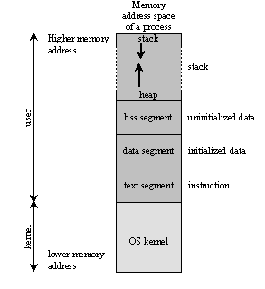

# Stack memory vs Heap memory

Whenever a program is run, it has two kinds of memories, stack and heap.

This describes the layout of memory when the program is run. 

Higher memory address is read off first, then the data that was at the top of the stack is removed and the data below it is read. 

Think of stack like a pile of dishes. To take a plate, sane people would pick up one from the top of the pile. Then the next one is picked, and so on.

Stack contains both function calls and local variables. Heap contains only variables.

BSS and data segments are not relevant, but they contain the global uninitialized and initialized data respectively.

Heap has a large amount of memory. More than stack. And most heap allocated things are freely resizable. However, the access to heap is significantly slower, and the elements may not be stored in a continuous fashion.
