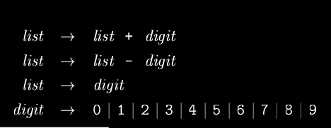
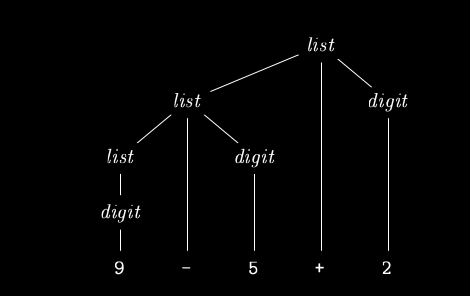

# compilers

## Syntax tree

- Nodes represent syntactic structure.
- We use abstract syntax tree for our purposes (cleaned up version of actual syntax tree).
- Actual parse tree may have small annotations.

## Lexical Analysis

- Obtain the entire file at once. Helps with mem allocation, speed and variable length tokens.
- Newline is a pain in the ass. Assume everything is linux and move on with life.

> What is a token?
>
> - No strict definition.
> - A good guideline is: "If separable by spaces, they are two different tokens, else they are one token."

Use regex to get identifiers.

Basic task of a lexer: given a set S of token descriptions and a position P in the stream, check if a token matches one of the descriptions and what it matches.

Also, match the one that is the largest fitting from all of S (**Maximal munch rule**).

### How to store tokens

- Use a lookup table to store a token identifier with corresponding name and type.
- Symbols like `=` are often stored in tokens as is because they don't need attributes.

## Syntactic Analysis

After lexing follows parsing. Generates a tree-like structure that uses the tokens and depicts the grammar structure of the tokens.

## Semantic Analysis

Checks for consistency with the language definition. Also saves type info in the syntax tree for later use in IR generation.
Also performs type checking and shit. May also do _coercions_ (implicit typecasting) when and where necessary.

## Grammar

- Terminals: Also called tokens. Symbols of the language defined by the grammar.
- Non-terminals: strings of variables.
- Productions: Has a Non-terminal, an arrow and a body. Basically tells us how to generate that non-terminal. The body can have terminals and non-terminals.
- One of the non-terminals is given a designation called the start symbol.

### Derivation

Basically all valid strings that can be generated from that grammar is the _language_ defined by the grammar.

### Parsing

Done using parse trees.

- Root labelled with the start symbol
- Each leaf if a terminal or $\epsilon$
- Each interior node is a non-terminal.

Ambiguity occurs when more than one parse trees are possible. Eg:

string $rightarrow$ string + string | string - string | 0 | 1 | 2 | 3 | 4 | 5 | 6 | 7 | 8 | 9

<!---TODO: Figure out Syntax directed translations--->
