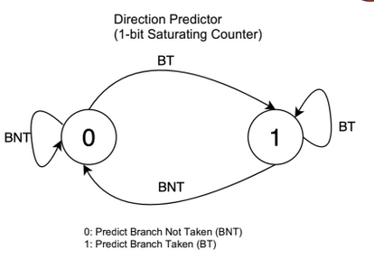
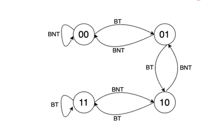

# cs2600

## Instruction Set

Different Instructions: x86, ARM, RISC V, MIPS.

- Programs written for one processor cannot execute on another.
- Early trend: more instructions, complex instructions.
- RISC -- Reduced Instruction Set Computing
  - Instructions are small and simple
  - Software does not complicate operations.

### How compilation happens

First the assembler converts the assembly to an object file. Here, the addresses
start with 0 and are relocatable. Later on the linker links multiple such object
files together and resolves function addresses, starting location, etc. using
something called as a **Linker Descriptor Script**.

## RISC V

Open source. Has 32 int and 32 FP registers. Also has XLEN variable, which is
either 32 or 64 for 32-bit and 64-bit processors respectively.

There are 13 callee saved registers. 12 of them are explicitly called *saved*
registers, and the first one of them (`s0`) is the *frame pointer* (equivalent to
**base pointer** in AMD64). The 13 one is the *stack pointer*.

| Register | ABI Name |                   Description                    | Saver  |
| :------: | :------: | :----------------------------------------------: | :----: |
|    x0    |   zero   |                   Zero always                    |        |
|    x1    |    ra    |                  Return address                  | caller |
|    x2    |    sp    |                  Stack Pointer                   | callee |
|    x3    |    gp    |                  Global Pointer                  |        |
|    x4    |    tp    |                  Thread Pointer                  |        |
|  x5-x7   |  t0-t2   |                      Temps                       | caller |
|    x8    |  s0 /fp  | saved / frame pointer (base pointer effectively) | callee |
|    x9    |    s1    |                  saved register                  | callee |
| x10-x11  |  a0-a1   |              Fn args/ return values              | callee |
| x12-x18  |  a2-a7   |                     Fn args                      | caller |
| x18-x27  |  s2-s11  |                 Saved registers                  | callee |
| x27-x31  |  t3-t6   |                   Temporaries                    | caller |

> Maximum memory depends on the size of the address bus from the load store unit
> to the memory.

The caller saved registers have to be explicitly saved by the caller function
in a stack frame before calling the other function. On the other hand, callee
saved functions are guaranteed to stay the same across function calls and there
is no need for functions to save them.

### Instructions

The ones listed below are called *R-type* or *register-type* instructions.

- `add rd, rs1, rs2`: add the contents of `rs1` and `rs2` and store it in `rd`.
  Signed addition. Also has the unsigned version. Similarly, sub, and, or, xor
  also exist.

- `mul/mulh rd, rs1, rs2`: multiplies and stores the lower/upper 32 bits in
  `rd`.

- `div/rem rd, rs1, rs2`: stores the quotient/remainder.

- `sll rd, rs1, rs2`: Left shift the number in `rs1` by the value in `rs2` and
  store in `rd`.

- `srl rd, rs1, rs2`: Right shift the number in `rs1` by the value in `rs2` and
  store in `rd`. Zero extends.

- `sra rd, rs1, rs2`: Right shift the number in `rs1` by the value in `rs2` and
  store in `rd`. Sign extends.

All of these also have an immediate version where the last argument is a
hardcoded literal that is 12 bits.

These are called *I-type* or *immediate-type* instructions.

- `l(b/h/w) rd, imm(rs1)`: loads a byte/half-word/word to `rd`(dest. register)
  from `*(rs1 + imm)`

- `l(b/h/w)u rd, imm(rs1)`: loads a byte/half-word/word to `rd`(dest. register)
  from `*(rs1 + imm)`. This one zero-extends on the left.

These are also *I-type* instructions.

The below one instruction is *S-type* instruction (for obvious reasons).

- `s(b/h/w) rd, imm(rs1)`: stores a byte/half-word/word to `*(rs1 + imm)`
  from the contents of `rd`.

The below instruction is called *B-type* or *branch-type* instruction.

- `blt/bltu r1, r2, label/offset`: if `r1 < r2` (signed or unsigned), jump to
  label or symbol. Can jump to atmost 4 KiB. (13 bits with the lsb always 0, the
  rest are used for determining values).

The above instructions have greater than, greater than equal to variants as
well. Also immediate variants of all.

#### Function calls

All of these can jump to at most 1 MiB as they take an immediate value of 20
bits apart from the lsb that's always 0.

The below type is called a *J-type* instruction.

- `jal rd, imm`: Jump to `pc + imm`, and store `pc + 4` in register `rd`.

The below one is an ***I-type*** and **NOT** J-type.

- `jalr rd, rs1, imm`: Jump to `rs1 + imm`, storing `pc + 4` in the register
  `rd`. Used for function pointers.

Both of the ones below are aliases.

- `j label`: alias to `jal zero, label`, discards the return address

- `ret rs1`: return to the address in `rs1`, if no argument is specified use
  `ra` (return addres register/`x1`). Alias to `jalr zero, rs1, 0`

For function calls we also need a stack-based execution. `x2` register is the
stack pointer that points to the top of the stack. Frame pointer `s0` saves the
base of the stack. These mark the stack frame in the stack.

> Always load and save values relative to the frame pointer.

Registers `a0` to `a7` are used to pass function arguments from one function to
another. These are 8 parameters. If we have more, then you need to use the
stack.

#### Control and status registers

- `csrrw rd, csr, rs`: atomic swap values

- `csrrs rd, csr, rs`: atomic copy to `rd` and set the bits that are set in
  `rs`.

- `csrrc rd, csr, rs`: atomic copy to `rd` and reset the bits that are reset
  in `rs`.

Atomic means that interrupts won't stop the entire set of operations that is
going on. If one of the operands is `x0/zero`, then that copying doesn't happen.

### Executing instructions

If we are using an operating system:

- Proxy Kernel is handling syscalls, mapping memory, program counter
  according to memory map, etc.

If we are without an operating system:

- Manually write the `.text` section to the flash memory.
- Load the `.data` section to the RAM.
- Set/reset the program counter to the required memory. It resets to a fixed
  value called as **reset vector**.
- Address out of range is your skill issue.
- Instruction fetched by the **Instruction Pointer**. 32 bits in width.
- Then it is sent to control ROM. This does not have microcodes and are instead
  hardcoded using combinational circuit.

#### Register Bank

Has all the registers and 2 muxs + 1 demux to select the register to use. There
is *dual porting* to read two source registers at once (hence two muxes).

#### Program Counter

This keeps track of the next instruction to be executed. Usually incremented by
4 unless branches. It resets to a fixed value called as **reset vector**.

Instructions and data are fetched every rising edge of the clock and that is
when the program counter is also incremented by 4.
The instruction fetched is later stored in the **instruction register**.

The instruction register sends it to the control unit which later sends signals
to whatever is responsible.

It also gets reset at interrupts to an interrupt vector and begins to consume
instructions from there.

#### ALU

Performs arithmetic (no shit). Has the **gen** module before it that generates
the immediate instruction from the opcode, regardless of whether it was an
*I-type* or not.

After this, there is a 2:1 mux that has a select line coming from the Control
Unit that decides whether or not the immediate values has to be selected or not,
the other option being 0.

## Multiprecision Arithmetic in RISCV

Multiprecision addition

```assembly
{{#include ./riscv/multiprec_add.s }}
```

Multiprecision subtraction

```assembly
{{#include ./riscv/multiprec_sub.s }}
```

Multiprecision multiplication

This is WRONG!!!!

```assembly
{{#include ./riscv/multiprec_mult.s}}
```

## Function call examples in RISCV

Recursive fibonacci

```assembly
{{#include ./riscv/recursive_fib.s}}
```

## Peripherals

They are also mapped to the memory. And properties can be changed using that
memory area.

The driver can be blocking or non-blocking. If blocking, it takes up a lot of
CPU power as it keeps polling the peripheral for data.
If it is non-blocking, then there are interrupts then they are detected at
hardware level within a clock cycle.

### Interrupts

If there is an interrupt, then the program jumps to the supplied **interrupt
service routine** and starts executing from there and returns to the OG
instruction once everything is done.

Hardware interrupts are done by a bus manager like the network controller (that
straight away receives a bunch of kilobytes) and use *DMA* (Direct Memory
Access) to straight away start using the memory.

There are software interrupts (for accessing devices like IO, sockets, etc.)
and hardware interrupts for, well, other stuff.

Apart from that there are exceptions as well that are raised by the CPU when
buttfuckery like division by 0 happens.

All the peripherals are connected to the **PLIC** (*Platform Level Interrupt
Controller*). There is also **CLINT** (*Control Local Interrupt Timer*) that
gives each core timer interrupts
that can be used a scheduler.

Interrupts have modes that define previlege level:

- Machine level: M mode, most privileged
- Supervisor level: S mode, OS privilege
- User level: U mode, all binaries run here

> In Intel machines these are called rings.

### Interrupt Handling

#### What caused the interrupt?

`mcause` has the first bit reserved for the interrupt type (interrupt or error)
and the rest 31 bits are used for indicating the subtype of the interrupt.

If the first bit is 1 then it was an interrupt else it was an exception.

To find out what peripheral caused the interrupt, the CPU uses the value given
by *PLIC*.

Filled automatically by the hardware when an interrupt happens.

#### Where is the interrupt vector address?

`mtvec` stores the address of the interrupt vector.

If the *mode* value is set to 1, it is **vectored**. The `pc` is set to
**BASE + 4 * cause**.

If *mode* is set to 0, it is a **direct** interrupt and all exceptions set
`pc` to **BASE**.

2 and 3 are reserved for future use.

> NOT hardcoded!!

#### Where to return to?

`mepc` holds the value of `pc` when the interrupt occured.

`mret` instruction loads the `mepc` to the `pc`.

#### What was the previous status level?

`mstatus` register has 4 bits that are mostly relevant to us.

`MPP[1:0]` stores the previous execution mode. These are the 12th and 11th LSB,
0 indexed.

- User mode: 00
- Supervisor mode: 01
- Machine mode: 11

`MPIE` holds the interrupt enable status in the previous mode. This is used to
determine if the previous mode had interrupts enabled for the lower privileges.
This is the 7th LSB, same scheme as above.

`MIE` holds the interrupt enable status in the current mode. 3rd LSB, same
scheme.

### Nested interrupts

To enable a nested interrupt, copy the data from `mepc`, `mcause` and `mstatus`.

`mie` register enables interrupts in machine mode if set. It is set to zero at
the start of the interrupt to make sure no other interrupts disturb the copying
of the data during a nested interrupt.

- 11th bit for external/DMA interrupt.
- 7th bit for timer interrupt.
- 3rd bit for Software interrupt.

These are 0 indexed LSBs.

### Pending Interrupts

`mip` register holds the important bits for any interrupt that wasn't executed
in between an instruction.

Bit scheme is the same as above.

## Virtual Memory Addressing

We introduce a **paging unit** between physical memory and the CPU, which is
unique for every process.

RAM is split into multiple page frames (usually 4 KiB). The virtual memory is
also split into multiple chunks of 4KiB size. These two chunks are then mapped
in some fashion which is stored in the **process page table**.

While scheduling, the program has an active page table that is maintained during
the program's runtime. In some cases, pages from multiple programs are loaded
simultaneously to the memory.

### Demand Paging

Virtual memory takes advantage of the fact that not all blocks need to be loaded
at once for the program to be executed. Hence, the paging table also has a value
called present bit that tells you if the page is present in the CPU or not.

If a page is not loaded when it was supposed to be, the program raises an
interrupt called **page fault exception**. There is a page fault exception
handler that takes care of loading the page and fill the page table. It may
remove a page frame of some other process if necessary.

There is another bit that keeps track of whether or not a page needs to be
written back to *swap* because of data updation. If the dirty bit is set to *1*,
we write stuff back to the swap. Else we don't to save memory operations.

There are also protection bits for each page to indicate the permissions of
each page. These are used for maintaining stuff like the code
being readable, stack being non-executable, etc.

Usually there are 2 level paging, where one table has the address of another
sub-table and there is an offset that are used together to obtain the memory.

### Shared memory

If two programs have the same page frame, then they share the same memory
physically that lets them have a common shared memory (eg. glibc sharing,
VDSO in linux).
You can also duplicate a page within a program by pointing two blocks to the
same frame.

### 2 level paging

The virtual address has the first 10 bits as offset from the
**page table base register**. This gives you the exact address of the page
table from the page directory. The next 10 bits store the offset from the base
of the page table. From this value the first 22 bits of the physical address
are obtained. The last 12 bits for both virtual and physical address are the
same. This scheme supports page directory sizes of 4KB and 4 MB.

For the *satp* register (the page table base register), the MSB will indicate
that translation is on or not. The next 9 bits are just meant for address space
separation for different processes. The next 22 bits hold the address of the
first level directory of the page translation. These 22 bits have to be left
shifted by 12 bits (which happens to be the page size as well) to get a 34
bit address that points to the base directory.

The page table format is as follows:

| PPN\[1\]                 | PPN\[0\]                 | RSW                | D                                            | A                                                                                                                                                 | G                                                                                                               | U            | X                | W            | R           | V                                                                                                                                                  |
| ------------------------ | ------------------------ | ------------------ | -------------------------------------------- | ------------------------------------------------------------------------------------------------------------------------------------------------- | --------------------------------------------------------------------------------------------------------------- | ------------ | ---------------- | ------------ | ----------- | -------------------------------------------------------------------------------------------------------------------------------------------------- |
| 12: physical page number | 10: physical page number | 2: reserved for OS | 1: Dirty (0 for non-leaf), used for swapping | 1: Accessed (0 for non-leaf) There are two somewhat complicated schemes that juggle how the page is updated and whether or not it is still valid. | 1: set to check whether the mapping is valid or not for all virtual address spaces, usually only used by the OS | 1: User mode | 1: execution bit | 1: write bit | 1: read bit | 1: valid bit, it is used for caching in TLBs. Implementations can cache both legally but ideally only if valid bit is 1, the translation is valid. |

The PPN\[1\] + PPN\[0\] of the first level are used to get the address of the
second level table. This too, has to be left shifted by 12 bits. Once we get
that, we use the PPN\[1\] + PPN\[0\] to get the first 22 bits of the **34 bit**
physical page address. The last 12 bits are the offset bits from the OG virtual
page address. 34 bits imply that a total of 16 GB is addressable and supported
in 32 bit RISCV architecture.

For a non-leaf page table entry, all three of the read-write-execute bits are 0.
If a page is writable it also has to be readable as well.

### 3 level paging

This is done for 64 bit architecture. This comes in two variants:

- 39 bit addressing
- 48 bit addressing

The *satp* for this scheme has 4 bits for mode specification and 16 bits for
address space separation. The rest is used for the base address of the top level
page directory. Once again, left shift by 12 bits before getting the root
directory's address. The first 4 bits are:

- 0 if virtualization is off.
- 8 if it is 39 bit scheme.
- 9 if it is 48 bit scheme.
- Others are reserved.

#### 39 bit

This scheme can support page table directories of sizes 4KB, 2MB, 1GB. The most
significant 25 bits are unused. There are a total of $2^{27}$ page table entries
. Once again, last 12 bits are the same.

The page table entry is as follows:

| *Reserved*                  | PPN\[2\]                 | PPN\[1\]                | PPN\[0\]                | RSW                | D                         | A                            | G                                                                                                               | U            | X                | W            | R           | V            |
| --------------------------- | ------------------------ | ----------------------- | ----------------------- | ------------------ | ------------------------- | ---------------------------- | --------------------------------------------------------------------------------------------------------------- | ------------ | ---------------- | ------------ | ----------- | ------------ |
| 10: reserved for future use | 26: physical page number | 9: physical page number | 9: physical page number | 2: reserved for OS | 1: Dirty (0 for non-leaf) | 1: Accessed (0 for non-leaf) | 1: set to check whether the mapping is valid or not for all virtual address spaces, usually only used by the OS | 1: User mode | 1: execution bit | 1: write bit | 1: read bit | 1: valid bit |

Once again, all of PPN\[2\] + PPN\[1\] + PPN\[0\] bits will be used to find the
page directory beginning in the subsequent levels. Also, left shift by 12 bits
before adding the offset from the VA.

### TLBs

These are special memory banks that store the frequently used mappings of
virtual memory and physical memory.

There are three types of TLB-cache combinations:

> Note: There is only one TLB for our purposes. So only one of the cache will
> have VIPT scheme. The rest is determined according to whether the level of the
> TLB is lower or higher.

#### Physically indexed physically tagged

In this case the virtual address is first looked up in the TLB. If the TLB leads
to a miss, it then goes on to check the page tables which are separate memory
operations of their own.

If the TLB gives a hit, then it goes on to check the cache, which is again a
hit or a miss.

This is slow as the cache needs to wait for the TLB to finish its operations
and then proceed further.

This is useful for low level caches though since they are rarely accessed. There
is no overhead of translations in case of TLB misses as it was already
translated for VIPT. Basically TLB misses will be fewer in this case.

#### Virtually indexed physically tagged

Used for L1 /L2 cache. TLB calculates the physical address to get the tag for
the cache. the index is obtained from the virtual address.

#### Virtually indexed virtually tagged

If only virtual addresses are used to calculate both the index and the tag.
This is used if L2 is using the TLB for VIPT and L1 has entirely VIVT.

## Von Neumann Architecture

Fetches the memory into various kinds of buffers to speed up memory fetch by
CPU.

### Caches

Each core has separate L1 cache for instructions and data. L2 cache is common
for both and mostly per-core (can also be shared across multiple cores). L3
cache is shared across all the cores.

### Registers

Apart from this there are also registers next to the ALU to speed up computation
. More can be slower or faster depending on the number. More means lesser loads
and stores. More also means longer routes (more time for pulse to travel) and
clock cycle logic to choose the register become slower.

### RAM memory

- Has capacitors.
- Capacitors discharge over time hence needs to be continuously powered and
  recharged.
- Take time to charge and discharge, which creates bottlenecks for CPU.

#### DRAM

Flow of types through time:

- SDRAM: Synchronous DRAM
- RDRAM: Rambus (company)
- DDR DRAM: Double data rate - over here both rising and falling edges will
  have actions.

DIMM chips: Dual inline memory modules

There are two ranks, with 8 chips for each. One rank is on one side. Each bus
activates all the 8 chips at once.

One layer/rank/side is only for data and the other is only for instructions and
commands. There is another bus that chooses the rank.

This is more efficient as one DRAM chip can be held using 8 pins only. This
reduces size and number of pins (they are costly).

However, this activates all the 8 DRAM chips at once when we don't need to, so
it is power inefficient.

For each DRAM cell, there are 8 **banks**, each of which has 8 arrays. Each
array has 64 bits, however the data is stored so that all the 8 arrays store a
bit each for any byte.

Each array has a *RAS* (row access strobe) and a *CAS* (column access strobe).
There are 8 rows and 8 columns. Each row has 8 bits, **but not from the
same byte**. Those are parallel.

Each RAS has selects a row and each CAS selects a column to fetch a bit. All the
8 bits from each of the array combine to form a byte. Therefore a bank stores
64 bytes but in parallel.

In each DRAM chip, at one time, only one bank works. The index of the bank is
the same for all the chips.

Each bank sends out a byte (we'll talk about bursts later).

It takes 9 bits to address a bit in DRAM. 3 for the array (8 in a bank), 3 for
the row, and 3 for the memory.

Steps for accessing a bit:

- Row address sent through RAS. Activates the entire row.
- All the charge in the row stored in the *Sense Amplifier*.
- CAS selects the bit and rest is sent back for recharging the capacitors.

Step 1 is the slowest. To improve that:

Store multiple bits after step 2 in a buffer. This is called a **burst**.

Burst sizes:

- DDR2: 4 bytes
- DDR3: 8 bytes
- DDR4: 16 bytes

The said buffer still sends out 8 bytes in 8 cycles. So, it takes 8 cycles for
1 burst. So a burst sends out 8 bytes per bank. This is stored in the row buffer
below the bank. Each DRAM chip uses one bank at a time. There are 8 DRAM chips,
so for a burst of 8 bytes, the total data sent in a burst is 64 bytes.

To improve upon it further, we do **bank interleaving**. How this happens is:

| T0       | T1         | T2         | T3         | T4         | T5       |
| -------- | ---------- | ---------- | ---------- | ---------- | -------- |
| read req | read burst | recovery   |            |            |          |
|          | read req   | read burst | recovery   |            |          |
|          |            | read req   | read burst | recovery   |          |
|          |            |            | read req   | read burst | recovery |

In the above each row is a separate bank. This approach always keeps the data
bus saturated.

DRAM refresh happens at bank level and requires all the energy to send the
charge back from the *Sense Amplifier* that is right before the column access
strobe back to the row from which the bits were fetched as we technically
discharged the capacitor to get the charges.

> Row hammer attack: When you activate rows that have one row in between such
> that the row in between changes values due to EM fields.
> Saltanat's work<br>
> EDIT: I've been lied to. She works on TEEs for legacy applications.

### Cache

Uses 6 transistors and is much faster than DRAM but also much costlier. This is
called an SRAM cell.

Each memory line in DRAM is mapped to a memory line in the cache. It is usually
32 bytes or 64 bytes per cache line.

#### Direct Memory Mapping

If there are L cache lines and A lines in the main memory, then the k'th line
is mapped to k mod L.

We have tag bits in the address, that are used to identify whether the addresses
match or not.

If the addresses don't match, we have a cache miss and we fetch the bytes from
the DRAM chip again.

Example:

Assume a cache with 1024 cache lines -> 10 bits for indexing the line.

Cache line size is 1 word (4 bytes) -> 2 offset bits within the word.

Address size = 64 bits => tag size = 64 - 10 - 2 = 52 bits.

This is the 64 bit address.

Now for the cache line size

| valid | Tag     | data    |
| ----- | ------- | ------- |
| 1 bit | 52 bits | 32 bits |

The valid bit checks if the cache line is valid or not. Can be invalidated due
to concurrency.

The tag bits of address and the cache line are XORed to check if it's the same.
If same, it is a hit. Then valid bit is checked. Finally data is fetched and the
offset is used to get the exact byte (if it is byte addressable).

##### Miss penalty

This is the time taken to fill a cache line when there is a miss.
There are two ways to lessen the miss penalty:

- **Early Restart**: The cache is filled sequentially like always but as soon as
  the required word/byte is written to the cache it is sent to the CPU to work
  upon. This is especially useful for instructions as they are mostly used in
  sequence.
- **Critical Word First**: The word that is required atm is the one that is
  fetched first and sent to the CPU and the rest is fetched in the background.
  This is helpful for data as that is mostly random access.

##### Writing back to memory

- **Write through**: Write to cache and DRAM both. Very slow since direct cache
  writes take a long time.
- **Write buffer**: Write to DRAM using a buffer where writes are queued. In the
  meantime the cache is also updated and the processor can continue to function
  as usual. If the cache line is flushed, then there is no need to be bothered
  as the write will be written by the priority queue before it is recalled.
- **Write back**: In this the cache line is written back to the DRAM when
  flushed.

##### Cache thrashing

When the same cache line is used for all the operations, it is flushed
repeatedly and is slow while all the other cache lines are just idle. This can
occur if you are iterating through every k'th step. To counter this, two other
schemes were used.

#### Fully associative Cache mapping

The entire address is used for tag bits. Apart from that any memory block in
DRAM can go anywhere in the cache. Now cache hits have become slower due to the
necessity of looking up all the cache lines. However this reduces cache
thrashing massively. To improve upon the lookup times, we use **set associative
cache mapping**.

#### Set associative Cache mapping

Tradeoff between hardware size and cache misses. A block of memory can be mapped
to any cache line in a set of cache lines. If there are S cache sets, then a
block A gets mapped to any cache line in A mod S.

Let there be 32 KB of cache with each line being 64 byte. Hence $2^{15}$ bytes
with $2^6$ bytes per line. So there are $2^9$ lines in total.

If the cache is 8-way set associative, then there are $2^6$ cache sets.

Now the least significant 6 bits are used for offset mapping for the bytes of
the cache line. The next 6 bits are used for identifying the set. The rest of
the bits are tag bits.

#### Split and Unified L1 Cache

- Split: leads to better performance since instruction and data can be fetched
  independent of each other. However, has the drawback that instruction cache is
  used much more frequently than data cache.

- Unified: Leads to better utilization of cache resources.

## Processor Pipelining

One instruction consists of mutiple things like instruction fetch (IF),
instruction decode (ID), register read (RD), execute (EX), data access (DA),
write back (WB). The minimum clock cycle time will be the largest instruction
consisting of all of these.

Instead, we make the clock cycle the largest of these individual actions. We can
do that because we add buffers in between the processor everywhere.

This makes the clock cycle lower. We can also layer multiple clock cycles from
different instructions now because they may not depend on each other. What
happens they do? Problems.

### Out of order writeback problems

Suppose instruction A has 5 pipelines and instruction B has 3 pipelines and B
was executed right after A. Then before A is over, B should have had its write
back into the registers. **If** an interrupt happens while B was over but A
wasn't, then when we return from the interrupt B will also be executed for the
second time and this can lead to potentially wrong values being stored in the
registers.

### Pipelining hazards

There are 3 types: structural, data and control

#### Structural Hazards

Take the unified L1 cache.

| clock cycle 1 | clock cycle 2 | clock cycle 3 | clock cycle 4 | clock cycle 5 | clock cycle 6 | clock cycle 7 | clock cycle 8 | clock cycle 9 |
| ------------- | ------------- | ------------- | ------------- | ------------- | ------------- | ------------- | ------------- | ------------- |
| IF1           | ID1           | EX1           | DA1           | WB1           |               |               |               |               |
|               | IF2           | ID2           | EX2           | DA2           | WB2           |               |               |               |
|               |               | IF3           | ID3           | EX3           | DA3           | WB3           |               |               |
|               |               |               | IF4           | ID4           | EX4           | DA4           | WB4           |               |
|               |               |               |               | X             | X             | IF5           | ID5           | EX5           |

The *X* denotes that IF5 cannot happen because DA2 and DA3 are already occupying
the bus. Hence split L1 cache == better.

#### Data Hazards

| instruction    | cycle 1 | cycle 2 | cycle 3 | cycle 4 | cycle 5 |
| -------------- | ------- | ------- | ------- | ------- | ------- |
| add t2, t0, t1 | IF1     | ID1     | EX1     | DA1     | WB1     |
| add t4, t2, t1 |         | IF2     | X       | X       | ID2     |

Stalls occur because of dependencies in data.

Other examples:

- Write after read: when a later write writes before an earlier read.
- Write after write: when a later write writes before an earlier write.
- Read after write: when it reads the earlier value instead of the later one.

Mitigations include:

- instruction reordering: has to be done by the compiler but can also be done by
  the processor although it complicates hardware.
- Operand forwarding: once data is in buffers forward the data from the buffers
  to the next instructions before writing to the registers.

#### Control Hazards

Branch instructions: Branch condition outcomes are only known at execution time.

Simple solution: Stall until execution time.

Slightly better but complicated solution: Move the check to decode stage. Eg.
XOR for equality.

This removes the stall in case the branch was not taken but if it was taken then
the buffer has to be flushed and the later instruction fetched.

This can be accomplished using simple counter structures known as branch
predictors.

Eg:





There are many other methods of predicting branches.

#### Branch Predictors

It has two buffers, a **direction predictor** and a **Branch Target Buffer**.

The branch target buffer is a cache that has entries in the format `pc:jump` for
every single `pc` value possible. That is $2^{32}$ possible `pc` values. In the
first invocation it actually stalls, calculates and loads the address. In
subsequent invocations it just reads it off from there.

The direction predictor is also a table of sorts that has one of those counters
for every single `pc`. Each time a branch is encountered, you fetch the counter
value and predict accordingly. And later on update the result in the counter.

This is good for single branches like loops and if-else. However in case of
nested branches performance can be improved by using something called as a
**GShare**.

A global share history buffer register is a shift register that stores the
values of the previous 32 branches. When we want to choose the index for the
direction predictor, we first XOR `pc` with the gshare value and then use it.
The branch target buffer indexing remains the same.

When we want to update the counter, we update both the counter and the gshare.
We update the original counter, and then push back the bit in gshare.

> May be nice to watch [this talk](https://www.youtube.com/watch?v=g-WPhYREFjk)
> by Fedor Pikus.

## Superscalar Pipelining

Basically scalar pipelines but in parallel. They are called s-issue pipelines.

An *s-issue* pipeline can execute *s* instructions in parallel.

On the other hand, there are diversified pipelines that can have multiple
different execute stages in parallel. This is because some of the execute stages
will hog more pipelines. Like Store instructions or floating point operations.

Unlike the buffers in single pipeline processors, superscalar pipelines are
multi-entry and multi-exit in nature. We can also have instructions leaving the
buffer out of order except for one special buffer called the **reorder buffer**.

Before the parallel execution stages in a dynamic pipeline, There is a **dispatch
buffer** that takes the entries from the *Istruction Decode* stage. Till now
evreything was in order.

From the dispatch buffer things can either go in order or out of order depending
on the execution time of the pipeline taken. Once the pipeline is completed the
intermediate results are stored in the **reorder buffer**.

The reorder buffer may have to be significantly larger than the other buffers
because situations may arise where there is a significant number of write backs
waiting for an incomplete instruction to complete.

For Eg. <float operation> <float operation> <add> <add> <add> <add>

Suppose floating point op takes 5 clock cycles in execution stage and add takes
1 clock cycle. We can see that before the second floating point operation is
over the 4 adds will be done. In a 3-issue processors this exceeds the maximum
look-ahead you usually needed to have and therefore the reorder buffer must be
significantly larger than the other buffers.

### Stages of a superscalar pipeline

- Instruction Fetch (IF): If s-issue then fetch s instructions at once.
  Increments accordingly.

- Instruction Decode (ID): Unlike scalar processors, these decode instructions
  do **not** read the register contents. They also identify dependencies between
  isntructions.

- Instruction Dispatch: This is done based on the availability of the
  ALU pipeline and the order in which the instruction Decode had reordered along
  with availability of the operands.

  Dispatch buffer can be a single continuous buffer or split into multiple
  buffers.

  **PROS** of singular: Better utilization of resources as stalls cannot happen
  that easily because the area of the buffer one type of instruction take isn't
  fixed.

  **CONS** of singular: Makes hardware much more complicated as buffers now need
  to be multiported. This is also very bulky as it is kinda fully associative
  cache.

  **PROS** of distributed: Simple hardware. Single ported multi entry buffers.
  Only one type of instructions are there.

  **CONS** of distributed: There may be more stalls now as one branch buffer may
  not have sufficient space to execute.

  > Hybrid is also possible. Intel does that.

- Execution Stage (EX): Can be utilized by having specialized hardware for
  certain operations. Also supports SIMD. This takes the addresses of 3 buffers
  that have some fixed length and performs the operations in parallel across the
  entire buffer at once **in one clock cycle**. This is a pipeline in and of
  itself.

- Instruction Completion and Retiring (WB): There is a **reorder buffer**. This
  waits for the instruction results to come up to pack them in order.
  This is necessary to prevent the problems of interrupts.

  For store instructions, they are *retired* only when the data is written back
  in the cache.
