# csd

> Moore's Law: The number of transistors in a dense integrated circuit doubles every two years.

How to represent a bit (What makes a good bit):

- small and inexpensive
- stable over time
- easy and fast to manipulate

## Using voltage to represent bits

- Ideal bit: 0 and 1
- Real bit using voltage: noise, ranged

- Voltage has a lower limit. 0 V - VL is interpreted as a `0`.
- Higher limit; VH to 5 V is considered high

- Between that is a forbidden zone.

## transistors

Two types, n type and p type.

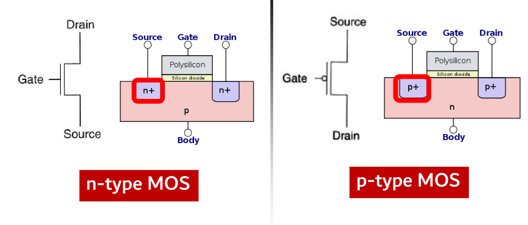

N-type acts as a wire when given high voltage at the gate and acts as an open circuit when given a low voltage. P-type works exactly the other way around.

### Logic gates using mosfets

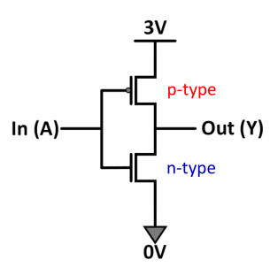

Basically two complementary networks for pull-up and pull-down respectively. Pull up is made from pmos and nmos is used for pull down.

#### Duality

To have the n type equivalent of a p type sub network, do the following:

- If A and B are in parallel in p type ($\bar{A} + \bar{B}$), in n type they will be in series ($\bar{A\cdot B}$).

Also holds the other way.

### Power losses

- Static: $P_{static} = V_{DD} \cdot I_{leakage}$
- Dynamic: $P_{dynamic} = \frac{1}{2}C\cdot \left(V_{DD}\right)^2$.
- Static is due to leakage current, dynamic due to inherent capacitance of the gates.

## Boolean Algebra

### Minterms

- Sum of products of all possible combinations that appear in the input. Eg. $\bar{A}BC + \bar{A}\bar{B}C + AB\bar{C}$
- Each minterm is one particular row in the truth table.
- For any function, find all possible minterms for which the function is true.
- The function is the sum of all those minterms, This is also called _Sum Of Products_ (SOP).
- Since the order of truth table is known, we can represent them as numbers alone. Start with all **FALSE**, then binary increment them.
- A not of any variable is take as a 0, otherwise it is take as a 1. This will give you the row number of that minterm (0 indexed).
- Finally $f = \sum{m\left(n1,n2,\ellipsis\right)}$

### Maxterms

- Exactly the opposite of above, we take the rows that are **FALSE** for the output. For each row, we sum the terms together instead of multiplying them.
- Then we multiply all the sums together. This is called (no shit) _Products Of Sums_ (POS).
- Enumeration is done in the same way as that of SOP. For shorthand notation, use M instead of m.

### Universal gates

- Any boolean function can be written entirely in terms of either one of NAND or NOT gates.

### Boolean Logic simplification

KMaps:

For 4 bits,

|        | AB      | A\~B    | \~A\~B  | \~AB    |
| ------ | ------- | ------- | ------- | ------- |
| CD     | Item2.1 | Item3.1 | Item4.1 | Item5.1 |
| C\~D   | Item2.2 | Item3.2 | Item4.2 | Item5.2 |
| \~C\~D | Item2.3 | Item3.3 | Item4.3 | Item5.3 |
| \~CD   | Item2.3 | Item3.3 | Item4.3 | Item5.3 |

- Circle as big rectangles as possible whose dimensions are powers of two.
- Keep check of wrap arounds.
- Take _don't cares_ in if they increase the size of the block otherwise don't.

## Combinational circuits

### Comparators

- Use NXOR for comparing two numbers.
- If two bits are equal, their NXOR is 1.
- So for equality bitwise NXOR the two numbers.
- If A is greater than B, then there are cases:
  - The first bit of A is greater than the first bit of B. $A_0\bar{B_0}$ will be 1.
  - The first bit is equal and the second bit of A is greater than the second bit of B. $\left(A_0B_0 + \bar{A_0}\bar{B_0}\right)\left(A_1\bar{B_1}\right)$
  - The first two bits are equal and the third bit of A is greater than the third bit of B. We can see that the pattern can be easily extended.

### Decoder

- N:2N. Basically creating minterms out of the given bits.

### Encoder

- Given N inputs, out of which only one is active, output its bits. This works properly only if one of the bits is active.
- Use KMaps to make the truth tables for the output lines. Basically check for which numbers the output lines become active and OR them accordingly.

#### Priority encoders

- To resolve the issue of multiple terms being active in an encoder, use _don't care_ conditions in the KMaps.
- Basically we don't care what the output at that instance will be. We can choose it according to our own convenience.

### Multiplexer

- Select one of the N inputs using $\log_2{N}$ selection lines.
- If the inputs are A and B, and the A has to be selected when S is 0, the output is $A\bar{S} + BS$. Logic can similarly be extended for and power of two.
- Treat the selection lines as the bits of the inputs. The first is the least significant and the last is the most significant.

### Adder

- 1 bit half adder:
  - Sum = A XOR B
  - Carry out = A AND B
- bit full adder:
  - Carry out = AB + BC + AC (C is carry in)
  - Sum = A^B^C
  - pass the carry out from the i'th bit to the carry in of the (i+1)'th bit.

For subtraction of two numbers, just add the 1's complement of the number that is to be subtracted and add 1.

## Sequential circuits

> Latches and flip-flops have 10+ transistors per bit.
> SRAM has 6 mosfets/transistors per bit.
> DRAM has 1 transistor + 1 capacitor per cell.
> Non-volatile storage: no transistors. Yay!

### R-S Latches

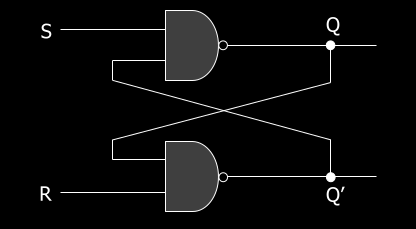

- R = 1, S = 1: previous state is held.
- 10 sets Q to 1.
- 01 sets Q to 0.
- 00 is a forbidden state (race condition, infinite toggling)
- QNEXT is S' + RQ

### Gated D Latch

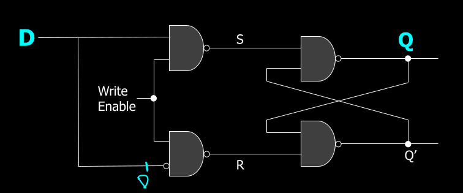

When `write-enable` is zero, it holds the previous value. When it is 1, it sets the value of Q equal to D.

### D flip-flops

Latches are retarded because they are level triggered. We want stuff to be edge triggered. Hence flip-flops. They are edge triggered enough to be suitable for most purposes and gives a singular time point (for all practical purposes it is a time point) when the flip flop does its action.

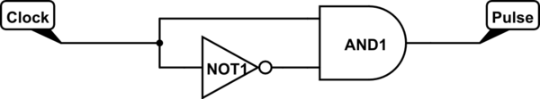

There is a slight delay in the NOT gate that is achieved with an RC circuit.

The rest of the circuit is the same as gated D latch. In both cases write-enable is connected to the clock with the only difference being in the triggering patterns and the extra circuitry involved in it.

### JK flip-flops

Pretty much the same as a R-S latch except with a write-enable feature and edge triggering.

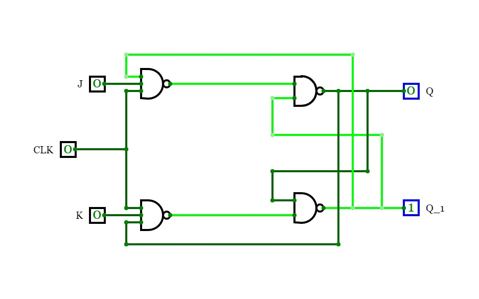

There are 4 modes :

- JK == 00, hold the state
- JK == 01, set Q to 0
- JK == 10, set Q to 1
- JK == 11, toggle the current value

Unlike RS latch there will be on problem with toggling here because the clock pulse is too small for a race condition.

Excitation table: like truth table but tells you what the current JK / D configuration should be to obtain the desired next value.

- For a D flip-flop, the current D should be the next desired Q.
- For an RS latch
  - if you want a 0 in the next state while current is 0, J should be 0. K can be anything.
  - if you want next to be 1 while current is 0, J should be 1. K can be anything.
  - if you want next to be 0 while current is 1, set K to 1. J can be anything.
  - if you want next to be 1 while current is 1, set K to 0. J can be anything.

### Counters and frequency dividers

- Down Counter: Does what you think it does

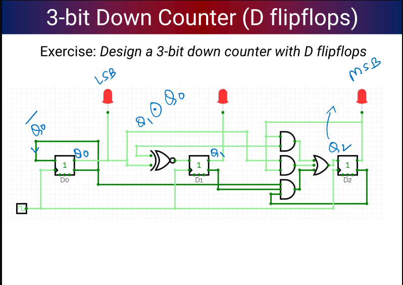

- Frequency divider: for powers of 2, for other numbers use a mod counter

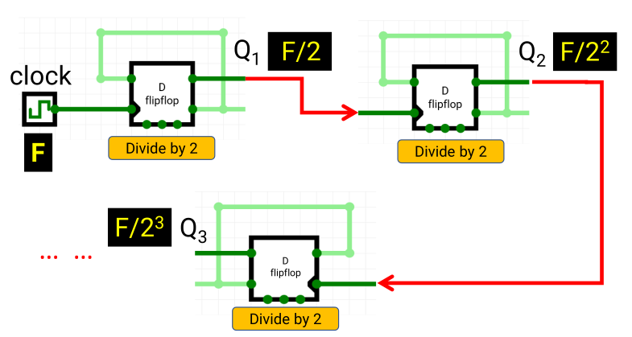

- Ring Counter: one hot encoded

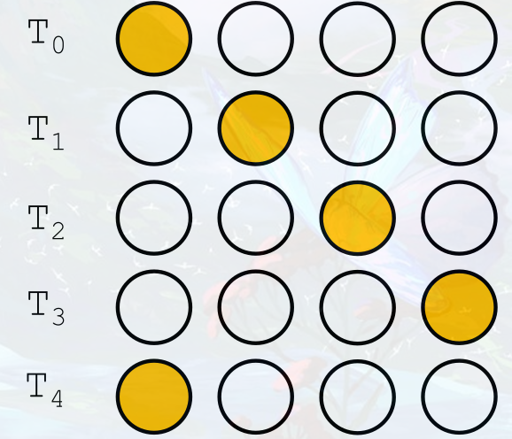

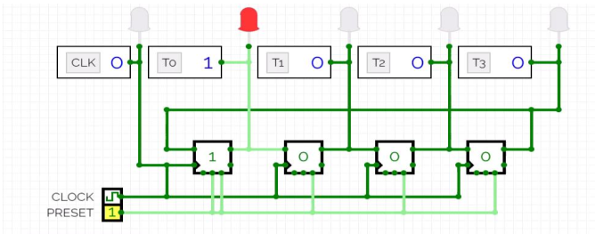

- Johnson counter: [Gray Code](https://en.wikipedia.org/wiki/Gray_code)

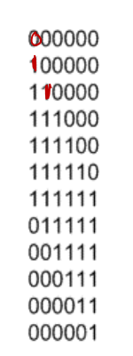

Same as ring counter except $\bar{Q}$ is fed as input to the first one.

### Registers

Multiple flip-flops with the same write enable. Can hold multibit values.

A variant called shift register is used for bit shift operations within the register.

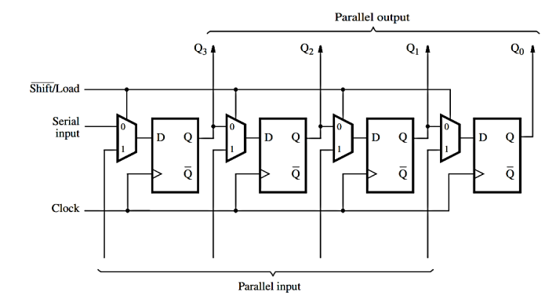

## Finite State Machines

Five components:

- states
- external inputs
- external outputs
- how all state transitions are determined
- how all outputs are determined

If there are 2k states, map them to k flip-flops and use the inputs to determine how the states and outputs change.

Two types:

- Moore: outputs depend only on the current state
- Mealy: outputs depend only on the current state and the inputs

## Final Computer architecture

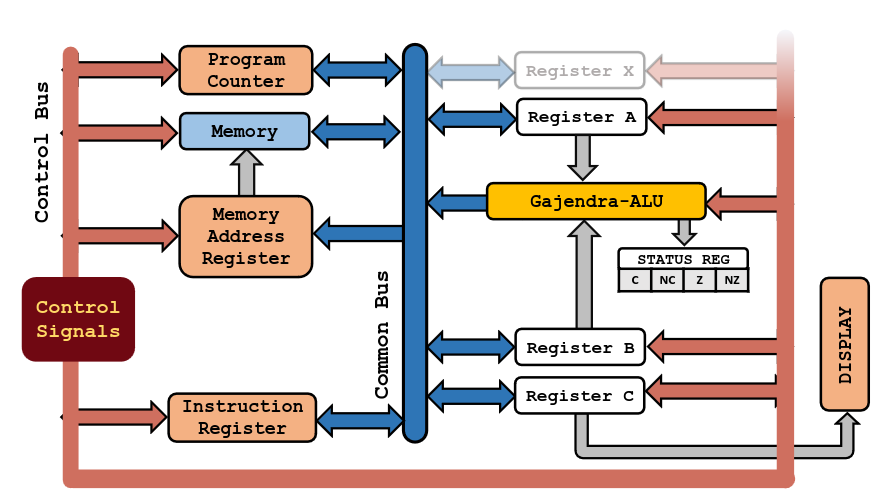

8 bit instruction architecture. First 4 bits are instructions and last 4 are data.

| Assembly | Machine Code |
| -------- | ------------ |
| NOP      | 0x0          |
| LDA      | 0x1          |
| STA      | 0x2          |
| ADD      | 0x3          |
| SUB      | 0x4          |
| LDI      | 0x5          |
| JMP      | 0x6          |
| OUT      | 0x7          |
| JNZ      | 0x8          |
| SWAP     | 0x9          |
| HALT     | 0xF          |

### Basic structure of all commands

#### LDA: Load from address into reg A

4 T-States

First T-State takes the output of program counter and gives to the memory address register.

`1 << PC_OUT | 1 << MAR_IN`

Second takes the output of memory register and sends it to the instruction register. This is possible because MAR output is always connected to Memory input and as soon as MAR receives an input the memory starts pointing to the location saved in the MAR. Program counter is also incremented at this point to get the next instruction from memory.

`1 << PC_INC | 1 << MEM_OUT | 1 << IR_IN`

These two T-States together constitute the fetch and mem-lookup cycle and are present for every control word.

The next two T-States are specific to LDA. The first takes the output of IR which has the memory address and sends it to MAR. The second one takes the output from memory and sends it to reg A.

`1 << IR_OUT | 1 << MAR_IN`

`1 << MEM_OUT | 1 << RA_IN`

#### ADD and SUB: Load into reg B from address and add/subtract and store the result in reg A

First two T-States are the same.
Third is also same as LDA.
In the fourth one, the value is loaded to B instead of A.

At the end of second T-State, the IR has the instruction that is to be executed. That time, the output of IR is directly connected to the **Instruction Decoder**, that checks for the instruction and sends the appropriate action to the ALU.

So the ALU already knows what to do. Once the 4th T-State is over, the ALU has computed the result and just needs to output it.

Fifth T-State ensures that.

`1 << PC_OUT | 1 << MAR_IN`

`1 << PC_INC | 1 << MEM_OUT | 1 << IR_IN`

`1 << IR_OUT | 1 << MAR_IN`

`1 << MEM_OUT | 1 << RB_IN`

`1 << ALU_OUT | 1 << RA_IN`

#### NOP: Does nothing just like the useless piece of shit you are

Only has a fetch + mem_lookup cycle.
