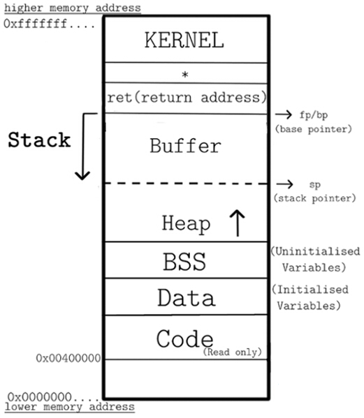

# hacking_basics

## How the Internet Works

[Internet Health Report](https://github.com/InternetHealthReport/gsoc/blob/main/ihr-contributor-handbook.md)

## Code Execution Important Details

- On the top of the memory space is the `kernel`, the literal system of the computer and also the place where environment variables and command line arguements are stored.
- At the bottommost we have the `code segment`, the raw bits and bytes of the program which is read-only. Write in it and boom, memory violation.
- Above the code segments are the `Data` and the `BSS` segments. They contain initialized and unintialized global variables respectively.
- Above that is the `heap` used for dynamic memory allocation. Values stored in `heap` grow upwards.
- After that comes the stack. It starts from the top and moves towards the bottom. Most buffer overflows happen in this region. The top of the stack (which is at the bottom of the memory space in stack) is tracked by the stack pointer. The bottom of the stack is where the interesting stuff happens.

## How a main function is executed:

1. Base Pointer is pushed to the stack.
2. Stack pointer value is copied to the base pointer.
3. Rn both base pointer and stack pointer point to the top of the stack.
4. The stack pointer is subtracted from and sent into a lower memory location if there are function calls.
5. The variables are added to a value offset from the last variable (initially from the base pointer) according to their size.

## Assembly Basics

The processor supports the following data types:

- `Word`: 2 byte structure
- `Doubleword`: 4 byte structure
- `Quadword`: 8 byte structure
- `Paragraph`: 16 byte structure

### Operation Suffixes

GAS assembly instructions are generally suffixed with the letters "b", "s", "w", "l", "q" or "t" to determine what size operand is being manipulated.

- `b` = byte (8 bit).
- `s` = single (32-bit floating point).
- `w` = word (16 bit).
- `l` = long (32 bit integer or 64-bit floating point).
- `q` = quad (64 bit).
- `t` = ten bytes (80-bit floating point).

If the suffix is not specified, and there are no memory operands for the instruction, GAS infers the operand size from the size of the destination register operand (the final operand).
