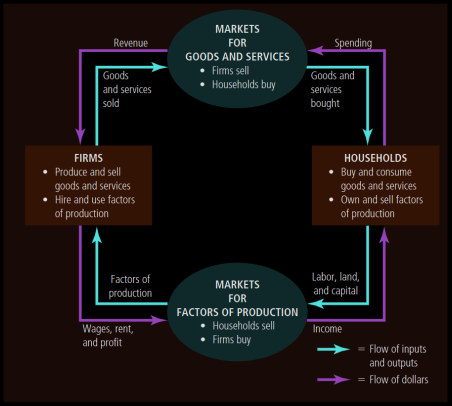
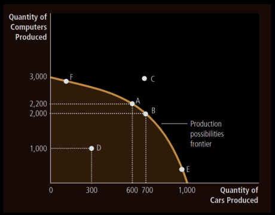
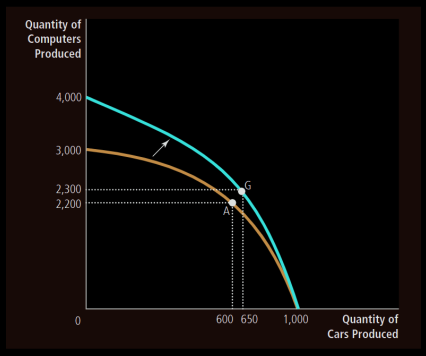

# Ch 1: Ten Principles of Economics

- Scarcity: Limited Nature of society's resources.
- Economics: The study of how society manages its scarce resources

## What do Economists study about?
1. How people make decisions: how much they work, what they buy, how much they save,
and how they invest their savings.
2. How people interact with one another
3. Analyze the forces and trends that affect the economy as a whole, including the growth in average income, the fraction of the population that cannot find work, and the rate at which prices are rising.

There are 10 principles of economics, out of which first 4 are about individual decision-making.

### How People Make Decisions
1. People face Trade-offs
To get something that we like we must give up something else that we also like, making decisions requires trading off one goal against another. When people are grouped into societies, they face trade-offs there too.

Imp example: 
- "guns and butter"
- Clean Environment vs Level of Income
- Efficiency vs Equality: 
    - Efficiency: The property of society getting the most it can from its scarce resources.
    - Equality: The property of distributing economic prosperity uniformly among the members of society.

2. The cost of something is what you give up to get it. Thus while making decisions people must compare costs and benefits.

Opportunity Cost: Whatever must be given up to obtain some item.

3. Rational People think at the Margin

- Rational People: people who systematically and purposefully do the best they can to achieve their objectives, given the available opportunities.
- Marginal Change: a small incremental adjustment to a plan of action.

Rational people often make decisions by comparing marginal benefits and marginal costs. We shouldn't consider average costs but marginal costs.

4. People respond to incentives

- Incentive: Something that induces a person to act.
- Incentives are the key to analysing how markets work.
- Higher prices is an incentive for buyers to buy less and producers to produce more.
- Public policymakers need to consider how their policies affect incentives.
- The US congress introduced a seat-belt law, but that just gave incentive to people to drive rashly.

The next 3 decisions are about how people interact with one another.

### How People Interact

5. Trade can make everyone better off
- Trade between two countries can make each of those countries better off.
- Trade allows each person to specialize in the activities she does best.
- By trading with others, people can buy a greater variety of goods and services at lower
cost.

6. Markets are usually a good way to Organize Economic Activity

- Centrally Planned Economies: The government decides what goods and services are produced, how much is produced and who produces and consumes these goods and services. The idea behind central planning is that the government can organize economic activity in a way that it promotes economic well-being for the country as a whole.
- Most countries that were centrally planned economies have abandoned the system.
- Many countries are developing market economies.
- Market Economy: An economy that allocates resources through the decentralized decisions of many firms and households as they interact in markets for goods and services.
- Firms decide who to hire and what to make
- Households decide which firms to work for and what to buy with their incomes
- Firms and households interact in the marketplace, where prices and self-interest guide their decisions.
- Central planners lacked the necessary information about consumer's tastes and producers costs which in a market economy reflects in prices.

7. Governments can sometimes improve market outcomes

Why do we need the government when we have the invisible hand of the market?

Cause the government needs to enforce rules and maintain the institutions that are key to the market economy.

- Property Rights: The ability of an individual to own and exercise control over scarce resources.
- Property rights are enforced by the government, they let individuals to own and control their own scare resources.
- The government needs to enforce our rights over things we produce and the invisible hand relies on our ability to enforce those rights.
- The government generally intervenes only when it is to promote efficiency or promote equality

- Market Failure: The situation where a market left on its own fails to allocate resources efficiently.
- Externality: The impact of one person's actions on the well-being of a bystander.
- Externality example: Pollution
- Market Power: The ability of a single person or firm (economic actor) to have unduly influence on market prices.

Market Failure can happen due to market powers and externalities. In such a situation a well-designed public policy can enhance economic efficiency. The invisible hand does not ensure equality, this requires government intervention.

### How the Economy as a Whole Works

8. A country's standard of living depends on its ability to produce goods and services.

- Productivity: The quantity of goods and services produced from each unit of labor input.
Standard of living (avg income) $ \propto $ Productivity

9. Prices Rise when the government prints too much money
- Inflation: An increase in the overall level of prices in the economy.
- Keeping inflation at a low level is a goal of economic policymakers around the world.
- Most cases of large or persistent inflation is due to the growth in quantity of money.
- When the govt prints a lot of money the value of money falls.

10. Society Faces a Short-Run Trade-off between Inflation and
Unemployment

Short Run Effects of Monetary Injections:
- Increase in overall spending and demand for goods and services.
- Higher demand may encourage firms to hire more workers and produce larger
quantities.
- More hiring means lower unemployment
- Business Cycle: Fluctuations in economic activity such as employment and production.

# Ch2: Thinking like an Economist

## Terms that economists use:
Supply, demand, elasticity, comparative advantage, consumer surplus, deadweight loss, etc.

## The Economist as Scientist:
Economists devise theories, collect data and analyse the data in an attempt to verify or refute
theories.
1. The Scientific Method: Observation, Theory and more Observation
- Economist's use theory and observation like other scientists, but conducting experiments in economics is often impractical.
- We have to thus make do with whatever data is available. Natural experiments are offered by history. Eg: depressions, wars, etc

2. The Role of Assumptions
- Assumptions simplify the complex world, make it easier to understand.
- Different assumptions are made based on the field of study.
- Assumptions should not affect the answers too much

3. Economic Models
Economist's use models to learn about the world. These models mostly consist of diagrams and equations.
Economic models omit many details to allow us to see what is truly important.

- Our First Model: The Circular-Flow Diagram
    - In this world, millions of people are engaged in so many activities
    - To understand this we need a model that explains how the economy is organized and how participants in the economy interact with one another.
    - Circular Flow Diagram: A visual model of the economy that shows how money flow through markets among households and firms.
    - In this model the economy is simplified to include only two types of decision makers: Firms and Households

    

    - Factors of Production: Inputs such as labor, land and capital (buildings and machines).
    - Firms produce goods and services using the factors of production. Households own the factors of production and consume the goods and services that firms produce. 
    - Households and Firms interact in two types of markets:
        1. Markets for Goods and Services: households are buyers and firms are sellers
        2. Markets for Factors of Production: households are sellers and firm buyers
    - There are two loops in the circular flow diagram, these are distinct but related:
        1. The inner loop represents the flow of inputs and outputs
        2. The outer loop of the diagram represents the flow of the corresponding money

- Second Model: The Production Possibilities Frontier
    - Most economic models use mathematics unlike the circular flow model.
    - Let us consider an economy that only produces two goods, cars and computers.
    - Thus the car and computer industry use up all the available factors of production.
    - Production Possibilities Frontier (PPF): A graph that shows the combinations of the output that the economy can possibly produce given the available factors of production and the available technology.
    
    - Extreme possibilities: end points of the PPF
    - Because the resources are scarce, not every conceivable outcome is feasible
    - The economy can produce any combinations inside or on the frontier. Any point outside is not feasible given the economy's resources.
    - The outcome is said to be efficient if the economy is getting all it can from the scarce resources it has available. Points on the PPF represent efficient levels of production.
    - Once we have reached an efficient point on the frontier, the only way to produce more of a good is to produce less of another: Face Trade-Offs.
    - The opportunity cost of a car is the slope of the PPF.
    - When an economy grows, society can move production from a point on the old frontier to a point on the new frontier.

    
    - Ideas put forward by PPF: scarcity, efficiency, trade-offs, opportunity cost, economic growth.

4. Microeconomics and Macroeconomics

- Microeconomics: The study of how households and firms make decisions and how they interact in markets.
- Macroeconomics: The study of economy-wide phenomena including inflations, unemployment and economic growth.
- Changes in the overall economy arise from the decisions of millions of individuals,thus we need to consider associated microeconomic decisions to understand macroeconomic developments.

## The Economist as Policy Advisor

Economists are scientists when they are trying to explain the world. When they are trying to improve the world, they are policy advisors.
### Positive versus Normative Analysis
- Positive Statements: They are descriptive, they make a claim about how the world is.
- Normative Statements: They are prescriptive, they make a claim about how the world ought to be.
- We can confirm positive statements by examining evidence and analysing data alone.
- Normative statements cannot be judged using data alone, we need to look into ethics, religion and political philosophy.
- Positive views affect normative views.
### Economists in Washington
- The presidents of US have a Council of Economic Advisers.
- They write an annual economic report of the president
### Why Economists' advice is not always followed
- Economists put forward the best policy in their perspective, but the president has other advisers for input also.
### Why Economists Disagree
Economists often disagree, this could be because:
- They may disagree about the positive theories.
- They may have different values,therefore different normative views about policies.
    - Differences in Scientific Judgements. Economists may disagree about the validity of alternative theories or about the size of imp parameters that measure how economic variables are related. Eg : Tax on income or spending
    - Difference in Values. Normative analysis cannot be done on scientific grounds only, economists who have different values may give conflicting advice.
    - Perception versus Reality. Many economic policies aren't executed due to political obstacles.

# Ch3: Interdependence and the Gains from Trade

What exactly do people gain from trade? Why do people choose to be interdependent?
## A Parable for the Modern Economy
1. Production Possibilities
There is also a consumption possibilities frontier, this production possibilities frontier.
2. Specialization and Trade
Trade allows everyone to pursue what they specialize in and thus makes everyone better off.
3. Comparative Advantage: The driving force of specialization.
    1. Absolute Advantage
    The ability to produce a good using fewer inputs than another producer.
    2. Opportunity Cost and Comparative Advantage
    The ability to produce a good at a lower opportunity cost than another producer. A producer who gives up less of other goods to produce a good X has a smaller opportunity cost of producing Good X and is said to have a comparative advantage producing it. It is possible for one person to have absolute advantage in both goods. It is impossible for one person to have comparative advantage in both goods, because the opportunity cost of one good is the inverse of the other, so if a person's opportunity cause for one good is relatively high, it will be relatively low for the other good. So one person will have a comparative advantage producing one good, the other will in producing the other good.
    3. Comparative Advantage and Trade
Gains from trade are based on comparative advantage. When each person specializes in producing the good for which he or she has a comparative advantage, total production in the economy rises. Increase in size of economic pie. Trade benefits all parties as they obtain a good at a price lower than their opportunity cost. Trade can benefit everyone in society because it allows people to specialize in activities in which they have a comparative advantage.
    4. The Price of the Trade
    For both parties to gain from trade, the price at which they trade must be in between the two opportunity costs.
4. Applications of Comparative Advantage
Populations of countries can also benefit from trade and specialization.
    - Imports: Goods produced abroad and sold domestically
    - Exports: Goods produced domestically and sold abroad
International trade can make individuals worse off even if it makes the country as a whole better off.
